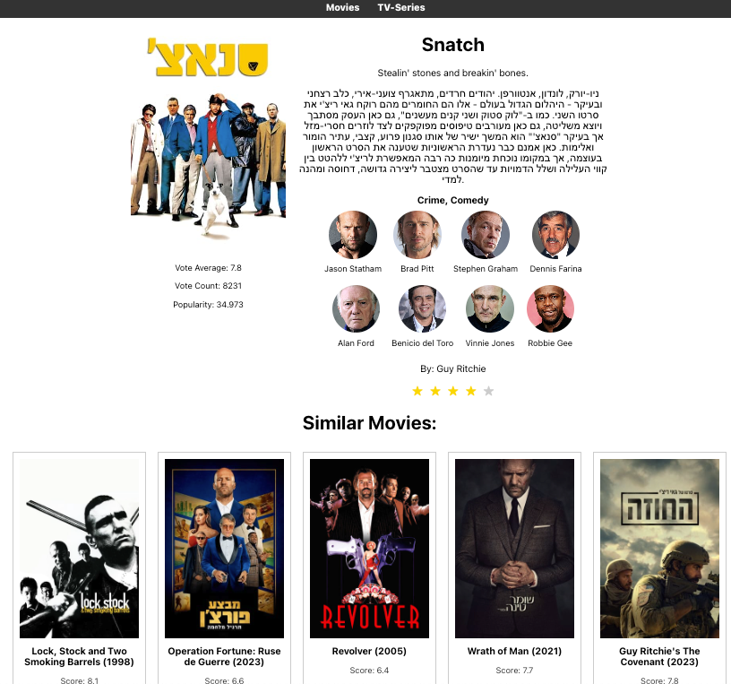

# Movie Recommender App

This repository contains the code for the Movie Recommender App, a React application, backed with fastapi app, that provides movie recommendations based on user preferences and similar movie content.




## Structure

- `backend/`: Contains the FastAPI application code.
- `frontend/`: React front-end application.
- `notebooks/`: Jupyter notebooks for analysis.
- `k8s/`: Kubernetes configuration files. WIP

## Prerequisites

- Docker
- npm
- Conda for notebooks environment

# USAGE
## Prerequisites

- [Docker](https://www.docker.com/get-started)
- [Git LFS](https://git-lfs.com/) (For large files versioning)

 ```bash
git lfs pull 
docker-compose up
```

# Local Development

## backend
### Prerequisites
 - poetry (1.2.2)
 - postgres instance url ([Docker](https://www.code4it.dev/blog/run-postgresql-with-docker/))
```bash
cd backend
poetry install

export DATABASE_URL="postgresql://..."

poetry run python app/local.py
```

## frontend
### Prerequisites
 - Node.js (>= 12.0.0)
 - npm (>= 6.0.0)

```bash
cd frontend
npm install
npm start
```

## notebooks
### Prerequisites
 - Install [Anaconda](https://www.anaconda.com/products/individual) or [Miniconda](https://docs.conda.io/en/latest/miniconda.html).

```bash
cd notebooks
conda create --name ntoebooks python=3.9
```

# Dataset for similarity recommendation

The datasets are located [here](./notebooks/datasets/mine/). They consist of **11,000 Movies** and **3,000 TV series** that were scraped from the TMDB API.

The scraper code can be found in the [movies](./notebooks/tmdb-movies-scraper.ipynb) and [tvs](./notebooks/tmdb-tv-scraper.ipynb) notebooks.